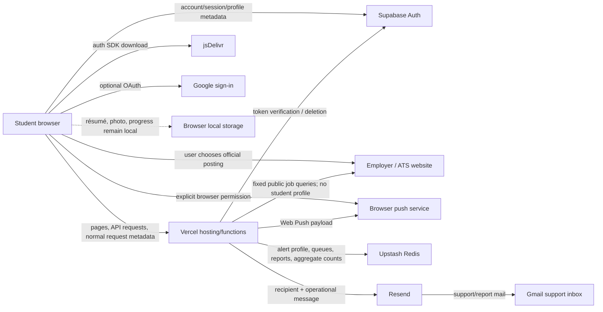

# Promptly pre-launch privacy engineering audit

**Audit date:** 24 August 2026

**Code baseline:** `main` at `00c6b90`, audited and remediated on `cam/privacy-prelaunch-audit`

**Production sampled:** `https://promptly-ctm.vercel.app/` on 24 August 2026

**Post-merge production recheck:** PR #16 was merged and the live assets now contain
the narrow server alert payload, identifier-free analytics, API cache bypass, and
updated privacy notice; the client no longer posts application stage or school.
The initial production-gap findings below are retained for
audit history and marked resolved where appropriate.

**Post-audit email-confirmation check:** Supabase's public production settings
returned `mailer_autoconfirm=false`, so email confirmation is currently required.
Because disabling confirmation implicitly sets a user's confirmation timestamp,
protected APIs now verify both the live `mailer_autoconfirm=false` policy and the
Supabase user record's `email_confirmed_at` timestamp. A policy change or unreadable
settings response fails closed for send/edit actions; authenticated account deletion
remains available. Confirmation-message delivery remains **UNKNOWN**
until tested with an inbox; the setting alone proves configuration, not delivery.
[Supabase documents](https://supabase.com/docs/guides/auth/users) the confirmation
timestamp and explains that unverified email users cannot sign in by default.

**Scope:** public web app, onboarding, account/profile sync, browser storage, analytics, listings and reports, email, push, admin/cron functions, privacy/terms copy, service worker, runtime dependencies, and public production responses.

This is a technical privacy assessment, not a legal opinion or certification. Legal applicability depends on Promptly's entity, users, markets, contracts, revenue, processing scale, and actual operating practices. Where the repository or public responses cannot prove a fact, the answer is **UNKNOWN** rather than assumed.

## 1. Executive privacy summary

Promptly has a privacy-favorable product shape: it has no ad network, tracking pixel, session replay, data broker, payment processor, CAPTCHA, error-monitoring SDK, or AI/LLM integration. Job ingestion is server-to-server and does not disclose student profiles to employers or ATS providers. Résumé parsing and matching run in the browser.

The pre-audit implementation nevertheless had four material trust failures:

1. API routes trusted a JSON email address as proof of account ownership. A caller who knew an address could overwrite that person's alert record or invoke email actions.
2. test-alert and test-recap requests serialized the full browser profile, sending résumé text and the photo data URL despite the product's “never leaves this device” promise.
3. application progress was sent with exact school, employer, stage, and field, while the privacy page called it anonymous and device-only.
4. the service worker cached all same-origin GET responses, including `/api/admin-stats`, outside the protections normal HTTP caching would provide.

Those issues are fixed and regression-tested on the audit branch. The branch also removes the persistent analytics session identifier, stops attaching account email to listing reports, installs report retention, scrubs legacy unnecessary contact/outcome data, clears local data on sign-out, binds test push to the owner's saved subscription, improves deletion ordering, adds just-in-time notice, and rewrites the privacy notice to match the product.

**Launch conclusion:** the core remediations have now been merged and observed in the live production assets. A controlled beta still requires the remaining production checks in section 14, especially real-inbox verification for Supabase confirmation and Resend delivery, retention-cleanup evidence, vendor/access review, and founder/legal decisions. The email-confirmation policy guard described above is a post-merge follow-up and is not live until its separate PR is merged.

## 2. Critical findings

| ID | Finding | Pre-fix impact | Branch status | Production status |
|---|---|---|---|---|
| P-01 | Account-linked APIs trusted caller-supplied email | Unauthorized modification of another student's alert profile, watches, and email actions | **Fixed:** bearer token is verified with Supabase; email is derived from the verified user | **DEPLOYED; confirmation-toggle guard pending follow-up PR** |
| P-02 | Service worker cached every same-origin GET, including admin/API responses | Account or founder data could persist in Cache Storage and be served later without respecting `Authorization` | **Fixed:** `/api` is never intercepted or written to Cache Storage; `no-store` is respected | **DEPLOYED** |

## 3. High findings

| ID | Finding | Status / required action |
|---|---|---|
| P-03 | Full profile was sent by test email/recap flows, including résumé and photo | **Fixed and deployed** with an explicit server payload allowlist. Verify a real signed-in network payload manually. |
| P-04 | Progress uploaded exact school + company + application stage | **Closed 3 Sep 2026.** Verified by reading the code: nothing writes `promptly:school:*` or `promptly:schoolfeed:*` any more, and `purgeLegacyOutcomeData()` deletes leftovers on every daily run. The outstanding action was "confirm cleanup metrics", which was impossible because the count only appeared in the cron's HTTP response — it is now persisted and shown on /admin.html. **Zero is the healthy state**; a non-zero count means something started writing them again. |
| P-05 | Signing out left résumé, photo, profile, saved jobs, and progress in the browser | **Fixed and deployed:** sign-out clears all origin local/session storage. Test on a shared-device scenario. |
| P-06 | Listing reports silently reused the signed-in account email | **Fixed and deployed:** report payload and stored record contain no reporter email; legacy emails are scrubbed. |
| P-07 | Active account and verified alert data have no inactivity limit | **Open founder/legal decision.** Adopt a period (proposed starting point: 24 months after last meaningful account use, with warning and extension) or document why account-lifetime retention is necessary. |
| P-08 | Production did not contain the remediations at initial sampling | **Resolved:** PR #16 merged and the core assets were observed live. Complete the remaining production checklist in section 14. |

## 4. Medium findings

| ID | Finding | Recommendation |
|---|---|---|
| P-09 | Exact school, graduation year, major, and interests are duplicated in Supabase account metadata and the Upstash alert copy | **Partly closed 3 Sep 2026.** `serverAlertProfile()` was a wholesale spread of `accountProfile()`, so the alert store received all four. `major` and `interests` are read by nothing server-side — not `matchesOpening()`, not any dashboard — so they are no longer sent, and the daily job scrubs existing records. Both remain in Supabase metadata, which is what makes a profile follow you to a new device. Graduation year is now sent as a coarse band rather than the exact year (option 2, chosen 3 Sep) — see below. School is still duplicated, which is the deliberate remaining trade: it is the field the school pilot conversations actually need. |

### P-09 remainder: resolved 3 Sep 2026 — option 2, coarsened

The alert pipeline never used graduation year; only the founder dashboard's
demographic tile did. Exact school plus exact graduation year is close to
identifying in a small cohort, and the cohort is currently four people.

The alert store now receives a BAND rather than the year: "graduated or
graduating", "1 year out", "2 years out", "3+ years out". The exact year stays
on the device, where it does real work (cycle matching, "Class of 2028" copy),
and in Supabase metadata so it follows you to a new device.

The pilot signal survives — "how many Trinity students, roughly how far from
graduating" still answers the school conversation — while the precision that
made it identifying does not. The band is computed at send time against the
academic year, which rolls in August, so it stays true as years pass.

`gradYear` was added to MINIMIZE_FIELDS so exact years already stored are
scrubbed by the daily job, not just absent from future writes.
| P-10 | Provider log, backup, regional-transfer, and deletion details are not established in repository evidence | Inventory the active Vercel plan/settings and execute DPAs with Supabase, Upstash, Resend, and any other processor before broad UK/EU launch. Record subprocessors and transfer mechanism. |
| P-11 | No self-service account export | Establish a verified manual export procedure before launch; automate a machine-readable download later. |
| P-12 | Email alerts, weekly recap, and reminders default on | Core job alerts may be the requested service; weekly recap classification is less clear. Founder and counsel should classify each category and, if any is marketing, change it to an unbundled, unselected opt-in with consent records. |
| P-13 | Résumé, photo, and Supabase session tokens are persistent browser storage readable by same-origin JavaScript | Sign-out clearing materially reduces shared-device exposure. Continue reducing XSS risk; plan removal of CSP `unsafe-inline`, self-host or integrity-pin the auth SDK, and consider an optional session-only résumé mode. |
| P-14 | Supabase's SDK is loaded from jsDelivr before a new visitor signs in when account support is enabled | Disclosed and functionally necessary for the current auth UI, but self-hosting the pinned SDK would remove an avoidable browser-side third party and supply-chain boundary. |
| P-15 | Privacy requests are handled through a shared Gmail inbox with no documented identity-verification, deadline, or audit process | Create a lightweight request register and response playbook with identity verification, jurisdiction, due date, systems checked, decision, and completion evidence. Do not place request content in analytics. |

## 5. Low findings

| ID | Finding | Status / recommendation |
|---|---|---|
| P-16 | Raw IP/email appeared in short-lived Redis rate-limit and delivery key names | **Fixed on branch** with SHA-256-derived opaque key parts. Vercel can still receive ordinary request metadata. |
| P-17 | Coverage requests retained requester email though only aggregate demand was used | **Fixed on branch;** new requests omit it and daily cleanup scrubs legacy records. |
| P-18 | Privacy/terms links were not adjacent to initial account collection | **Fixed on branch** with a concise just-in-time notice. It is notice, not a fake consent checkbox. |
| P-19 | No explicit Global Privacy Control handling | No sale, sharing for cross-context advertising, or targeted advertising was found, so there is currently nothing to opt out of. Re-evaluate before adding advertising or cross-site analytics. |
| P-20 | The public internal slides editor stores its edit key in local storage | Not student personal data, but it should not be treated as a secure authentication mechanism. Restrict or remove the tool before a public launch as a separate security task. |

## 6. Complete third-party inventory

### User-data and delivery services

| Service | Contact path | Data involved | Purpose | User data sent? | Retention evidence | Required owner action |
|---|---|---|---|---|---|---|
| Vercel | Browser → hosting; functions run on Vercel | IP, request headers, path, time, user agent; function inputs in transit | Hosting, routing, functions, security/operations | Yes | Runtime log access varies by plan; official documentation currently lists 1 hour Hobby, 1 day Pro, 3 days Enterprise, or 30 days with Observability Plus. Actual plan/drains are **UNKNOWN**. [Vercel runtime logs](https://vercel.com/docs/logs/runtime) | Record plan, region, log drains, team access, and actual retention. Avoid logging bodies/tokens. |
| Supabase | Browser SDK; functions verify token and delete account | Email, password submitted during password auth, auth identifiers/session, optional Google identity, profile metadata, saved-list references. Promptly's own API does not store the password. | Authentication and cross-device account sync | Yes | Browser client persists sessions in local storage by default; sessions are indefinite by default unless configured. [Supabase JS auth](https://supabase.com/docs/reference/javascript/auth), [sessions](https://supabase.com/docs/guides/auth/sessions). DPA states agreement duration unless earlier deletion is requested. [Supabase DPA](https://supabase.com/downloads/docs/Supabase%2BDPA%2B250805.pdf) | Check session lifetime, MFA/admin roles, region, backups, DPA, subprocessors, and deletion test. |
| jsDelivr and its CDN subprocessors | Browser downloads Supabase UMD SDK | IP, request headers, package URL/time | Client library delivery | Network metadata only | Exact end-user request-log retention is **UNKNOWN** from inspected evidence. [jsDelivr terms and subprocessors](https://www.jsdelivr.com/terms/sub-processors) | Prefer self-hosting the pinned library; otherwise document vendor/subprocessors. |
| Upstash Redis | Vercel functions → Upstash | Alert profile, preferences, email, saved alerts, watches, push subscription, queues, opaque abuse buckets, reports, aggregate counters | Matching, notification delivery, operations | Yes | App-set TTLs are in section 12. Provider backup timing is contractual/settings-dependent. Upstash's DPA describes deletion or scheduled backup deletion after termination. [Upstash DPA](https://upstash.com/static/trust/dpa.pdf) | Execute DPA, confirm region/backups/team access, and verify retention cleanup metrics. |
| Resend | Vercel functions → Resend | Recipient, name/greeting, listing/email content, unsubscribe headers; report notification content | Operational email delivery | Yes | Provider policy says data is kept only as necessary but does not establish a precise message-content period; treat exact retention as **UNKNOWN**. [Resend privacy policy](https://resend.com/legal/privacy-policy), [DPA](https://resend.com/static/documents/resend-dpa-signed.pdf) | Verify sending domain, DPA/subprocessors, message-log/content retention, access, and suppression handling. |
| Gmail / Google Workspace consumer inbox | Resend → support inbox; user mailto → Gmail | Support message and listing report content; sender address when user emails support | Human support and report review | Yes | **UNKNOWN**; depends on Gmail account and manual deletion | Turn on MFA, minimize mailbox access, define retention, avoid forwarding, and migrate to a managed workspace/helpdesk when volume grows. |
| Google OAuth | Browser/Supabase redirect when user chooses it | Google identity, email, OAuth/session metadata | Optional sign-in | Yes, user-initiated | **UNKNOWN** for Promptly's configured Google/Supabase project | Verify OAuth consent screen, scopes (identity/email only), redirect URLs, and provider contracts/settings. |
| Apple Push Notification Service, Firebase Cloud Messaging/Google, Mozilla autopush, Microsoft WNS | Browser creates subscription; Vercel sends through the `web-push` library | Push endpoint/keys and notification payload; lock screen may show company/role/deadline | Optional push alerts | Yes, after explicit browser permission | **UNKNOWN** by provider | **Closed 3 Sep 2026.** Payload verified minimal (employer, role, official URL — no school, name, email or progress) and pinned by a test. Endpoint retention fixed: it is now dropped when push is switched off, and the browser subscription is released too. Lock-screen exposure is disclosed next to the push settings. |

The following supplement records the remaining required necessity, timing, minimization, and risk decisions for every service above:

| Service | When data is sent | Product/legal necessity | Can it be minimized further? | Retention unknown? | Privacy risk |
|---|---|---|---|---|---|
| Vercel | Every page/API request | Technically necessary to host the current service; legal basis requires founder/counsel documentation | Yes: never log bodies/tokens; shorten logs and restrict access | Yes, until plan/drains are checked | Medium — broad infrastructure visibility |
| Supabase | SDK/session restore; signup/login/sync/delete | Necessary for chosen account/cross-device feature; local-only fallback exists when disabled | Yes: session limits, minimal metadata, restricted OAuth scopes | Partly | Medium–High — identity, sessions, profile |
| jsDelivr | Page initialization when production auth is enabled | Not strictly vendor-necessary; library delivery is necessary but can be self-hosted | Yes: self-host the pinned SDK | Yes | Medium — pre-account network disclosure and supply-chain boundary |
| Upstash | Account alert save/watch/report/event; cron processing | Necessary for server alert delivery/queues in current architecture | Yes: remove duplicate academic fields after founder decision; continue TTLs | Provider backup timing yes | High — main operational profile store |
| Resend | Operational/report email send | Necessary only for requested email delivery | Yes: send one recipient, minimal template fields, no résumé/school | Exact logs/content yes | Medium–High — inbox identity and job-interest content |
| Gmail support inbox | User support message or report notification | Necessary for current human support, but provider/account choice is replaceable | Yes: no reporter email for listing reports; managed inbox and shorter retention | Yes | Medium — free text can contain anything users submit |
| Google OAuth | Only when a user chooses Google sign-in | Optional authentication convenience, not required for core product | Yes: identity/email scopes only | Yes | Medium — identity-provider linkage |
| Browser push services | Subscription creation and each enabled push | Optional; necessary only for the push feature the user enables | Yes: generic preview mode could reduce lock-screen detail | Yes | Medium — persistent endpoint and visible notification content |
| Employer/ATS job systems | Scheduled backend refresh; direct browser visit only after a user clicks | Necessary for live job data and chosen apply link | Already minimized: fixed job queries, no student data; avoid Promptly tracking parameters | Their independent visitor retention is unknown | Low server-side; Medium after user leaves Promptly |

No Stripe/payment service, ad network, ad exchange, data broker, CAPTCHA, session replay, crash reporter, behavioral analytics SDK, social pixel, or AI provider was found.

### Job-data services and employer sites

`api/_shared/sources.js` is the complete machine-readable registry: **241** sources — Greenhouse 106, Workday 57, Ashby 23, Flo Recruit 11, SmartRecruiters 6, Lever 5, USAJOBS 1, and custom 32. These connections are Vercel-to-public-job-system requests containing fixed search parameters, not student profiles.

The custom adapter inventory is complete by company and observed platform:

| Platform / method | Companies |
|---|---|
| Oracle Recruiting Cloud | JPMorgan, American Express |
| Eightfold | Millennium, Estée Lauder, Netflix |
| Salesforce Experience Cloud | Balyasny |
| Avature | Two Sigma, L'Oréal |
| TalentBrew / branded search fragments | Charles Schwab, Citizens |
| Phenom | Regions, Truist, Roche; Citi uses a Phenom-style branded results endpoint |
| Radancy | Unilever, Sanofi, Disney, Sony Pictures |
| Jibe | Stifel, PepsiCo |
| Dayforce | Interactive Brokers |
| iCIMS | Lord Abbett |
| Workday with stricter custom US filter | Novartis |
| SAP SuccessFactors / Recruiting Marketing | Adidas, Paramount |
| Attrax | AbbVie |
| Public GraphQL | Goldman Sachs |
| Public sitemap or first-party rendered page | Citadel, D. E. Shaw, Nuveen/TIAA, Baird |

Flo Recruit covers 11 law-firm boards: Gibson Dunn, Kirkland & Ellis, Latham & Watkins, Skadden, Sidley Austin, White & Case, Jones Day, Davis Polk, Sullivan & Cromwell, Simpson Thacher, and Cravath.

When a user clicks an official posting, the browser leaves Promptly. The employer/ATS then receives ordinary visit data under its own terms. Promptly does not append a student profile or Promptly user ID to those links.

## 7. Analytics event inventory

The branch accepts only the event name and increments a date-bucket counter in Upstash. Daily keys expire after about nine days. No client identifier, account identifier, search term, company, role, location, school, URL, or profile is included.

| Event | Trigger / purpose | Personal data in event body |
|---|---|---|
| `app_open` | App initialization / traffic volume | None |
| `view_change` | Navigation use | None |
| `opening_view` | Listing-detail use | None |
| `source_click` | Official posting click volume | None; destination is not included |
| `save_opening` | Save action volume | None |
| `signup` | Completed profile/onboarding volume | None |
| `search` | Search feature use | None; query is not included |
| `install_prompt` | Install flow use | None |
| `listing_reported` | Report feature use | None; report content is stored separately for operations |
| `watch_prompt_from_search` | Watch-company prompt use | None |
| `new_listings` | Server-side refresh count | Aggregate count only |

The old `promptlySession` local-storage ID and daily session sets were removed. “App opens” replaces the misleading “active users” metric. Application outcomes are no longer analytics.

## 8. Cookie and browser-storage inventory

### Cookies

- Promptly application code contains no `document.cookie` use and no `Set-Cookie` behavior.
- The sampled production root and `/api/auth-config` responses returned no `Set-Cookie` header on 24 August 2026.
- Supabase is configured as a browser client and defaults to local storage, not app cookies, for its session.
- Vercel security products may set mitigation cookies only under certain configurations or challenges; active configuration is **UNKNOWN** and must be checked in the Vercel dashboard and a clean-browser network capture.
- Google OAuth and employer/ATS destinations are separate sites and may set their own cookies after the user chooses to visit them.

| Cookie name | Provider | Purpose | Party | Duration / expiration | Category | Sensitive? | Consent consideration |
|---|---|---|---|---|---|---|---|
| None observed from Promptly | Promptly | N/A | First party | N/A | N/A | N/A | No app-cookie consent required |
| **UNKNOWN / conditional** mitigation cookie | Vercel | Bot/firewall protection if enabled or challenged | First party in browser, infrastructure provider | **UNKNOWN** until dashboard/manual capture | Necessary security if present | Could be a persistent identifier | Confirm configuration; security exception may apply |
| Provider cookies after Google sign-in redirect | Google | OAuth account/session/security | Third party / provider context | **UNKNOWN** | Necessary for optional sign-in once chosen | Authentication-related | Governed by Google context; disclose and keep optional |
| Provider cookies after official-posting click | Employer/ATS | Employer application/session/analytics under outside site's terms | Third party / destination context | **UNKNOWN and outside Promptly control** | Varies | Varies | User has left Promptly; no Promptly banner can control these |

### Local storage

| Key / family | Contents | Duration / clearing |
|---|---|---|
| `openingProfile` | Local profile including résumé text/photo data URL and UI/preferences | Until sign-out, restart, deletion, browser clearing, or origin eviction |
| `promptlySavedCompanies` | Saved listing references | Same |
| `promptlyStatuses` | Per-listing applied/interview/offer state | Same; device-only |
| `promptlySeenAlerts` | Seen listing identifiers | Same |
| `openingPushSubscription` | Web Push subscription | Same; server copy follows account deletion |
| `promptlyPendingMigrationEmail` | Temporary local-to-account migration marker | Removed after auth migration or failure; sign-out clears |
| Supabase `sb-…-auth-token` family | Access/refresh session maintained by SDK | SDK-managed; sign-out and origin clearing remove browser copy |

The former `promptlySession` analytics identifier is removed on the branch.

### Session storage and Cache Storage

- `promptlyMigrateLocal` is a short-lived account migration flag.
- `promptlyAdminSecret` exists only on the founder admin page for the current tab/session.
- The service worker keeps public app-shell files in Cache Storage for offline use. The branch never intercepts `/api` and refuses `no-store` responses.

### Consent conclusion for storage technologies

No banner is recommended solely for the code now present: the storage is first-party and tied to the profile, authentication, saved state, security, and explicit push feature a user requests; identifier-free event counting does not write/read the device. UK ICO guidance confirms that storage/access technologies are broader than cookies and that consent generally applies unless an exception, such as strict necessity for a requested service, is met. [ICO storage/access exception guidance](https://ico.org.uk/for-organisations/direct-marketing-and-privacy-and-electronic-communications/guidance-on-the-use-of-storage-and-access-technologies/what-are-the-exceptions/)

This is a technical recommendation, not a legal determination. Counsel should confirm the intended UK/EU position. Adding optional analytics, advertising, experimentation identifiers, pixels, or replay would require a new assessment before deployment.

### Automatic collection, marketing site, and waitlist

The public root is both Promptly's marketing/onboarding surface and the product. Before account creation it requests public app files, `/api/auth-config`, `/api/openings`, and sends the identifier-free `app_open` event. When auth is enabled it downloads the Supabase SDK from jsDelivr and the SDK checks/restores an existing Supabase session. Vercel necessarily receives normal request metadata such as IP, user agent, path, time, and headers. The app does not request browser geolocation; approximate location may still be inferred by infrastructure from IP, but no application code was found storing that inference.

No active waitlist, newsletter form, referral-ID persistence, marketing lead form, pixel, ad conversion tag, or automatic marketing subscription was found. Repository history/copy mentioning a waitlist does not establish a live waitlist database. If historic waitlist records exist outside the repository, their system, fields, access, linkage to accounts, marketing status, and retention are **UNKNOWN** and require a founder inventory before reuse.

## 9. AI data-flow map

**Current result: no AI/LLM processing found.**

- résumé parsing: local browser libraries and local text extraction;
- matching/ranking: deterministic browser code;
- “Ask Promptly”: scripted local answer selection, not a generative model;
- job filtering: deterministic server code;
- no OpenAI, Anthropic, Google Gemini, embedding, vector database, prompt logging, model training, or AI subprocessors.

Therefore there is currently no AI consent, AI retention, model-training opt-out, or AI vendor disclosure requirement arising from product code. If an AI feature is proposed, conduct a new data protection impact assessment before sending any résumé, education, job-progress, or support data.

## 10. Email and notification review

- Account confirmation/reset emails are provided through Supabase's auth system.
- Resend delivers matched-opening alerts, daily digests, weekly recaps, deadline reminders, verification reminders for legacy records, and listing-report notifications to the support inbox.
- Each alert email is sent to one recipient; no shared CC/BCC list was found.
- Alert mail includes an opaque unsubscribe token and one-click `List-Unsubscribe` headers.
- The branch requires a verified Supabase session for saves, watches, test email/recap, and test push; it derives the target email from that session.
- Push requires browser permission. The branch binds a test push to the subscription stored for that authenticated account.
- Lock-screen payload content is disclosed next to push settings; no school, email, résumé, or application progress is included.

US CAN-SPAM treatment depends on each message's primary purpose. FTC guidance treats transactional/relationship status narrowly and requires commercial messages to include accurate headers, a postal address, and opt-out handling. [FTC CAN-SPAM guide](https://www.ftc.gov/business-guidance/resources/can-spam-act-compliance-guide-business)

For UK users, routine service messages differ from direct marketing, while unsolicited individual electronic-mail marketing normally needs consent or a valid soft opt-in; pre-ticked boxes are not valid consent. [ICO electronic-mail guidance](https://ico.org.uk/for-organisations/direct-marketing-and-privacy-and-electronic-communications/guidance-on-direct-marketing-using-electronic-mail/how-do-we-comply-with-the-pecr-electronic-mail-marketing-rules/)

**Decision required:** document whether each Promptly category is a user-requested service communication or marketing. Do not add promotions to operational alert templates without reclassification and consent work.

### URL privacy findings

- No email address, name, résumé identifier, school, or full profile is placed in Promptly URLs.
- Email confirmation and unsubscribe links use opaque tokens rather than email addresses. Verification tokens expire after seven days and are single-use; unsubscribe mappings are removed at account deletion.
- OAuth uses PKCE and the callback is removed from the visible browser URL after processing. These short-lived callback values may still be visible to the browser/provider during the flow and must never be logged by application code.
- Official employer links contain the employer's public job URL only; Promptly does not append a student or analytics identifier.
- The admin page keeps its secret in session storage and sends it in an `Authorization` header, not a query parameter.

## 11. Privacy notice reality check

| Claim area | Before audit | Branch reality |
|---|---|---|
| Résumé/photo stay local | False in test email/recap transit | True; explicit payload allowlist and regression test |
| Progress stays local / anonymous | False; exact school/company/stage uploaded | True; uploads removed/refused and legacy cleanup added |
| Analytics | Persistent random session ID was omitted from disclosure | Identifier removed; exact event inventory disclosed |
| Providers | Supabase, jsDelivr, Google sign-in, Gmail support, and automatic hosting metadata missing | Core processors and data purpose disclosed |
| Cookies/storage | Local/session/Cache Storage and auth persistence not explained | Disclosed with clearing behavior and external-site boundary |
| AI | Ambiguous because “Ask Promptly” sounds like AI | Explicitly states no AI/LLM and describes local scripted tool |
| Retention | Mostly absent; deletion claimed no shadow copy | Concrete app TTLs disclosed; provider logs/backups accurately qualified |
| Deletion | Auth was deleted before Redis, risking stranded data | Alert data first, then auth, so failure remains retryable |
| Reports | Account email was silently added | No reporter email; 90-day expiry disclosed |

The branch privacy page is an accurate plain-language product notice for the observed code. It is not yet a counsel-drafted statutory notice containing every jurisdiction-specific category, legal basis, international transfer, representative, or appeal right.

## 12. Retention schedule

| Data | Current branch retention | Enforcement | Assessment |
|---|---|---|---|
| Supabase account/profile | Until deletion; session lifetime depends on Supabase settings | User deletion + provider settings | Inactivity policy still needed |
| Verified Upstash alert profile, watches, saved alerts, push endpoint | Until deletion | Authenticated deletion | Inactivity policy still needed |
| Legacy unverified alert profile | 14 days | Daily retention job | Appropriate; confirm cron metrics |
| Verification token | 7 days | Redis TTL | Appropriate |
| Digest queue | 3 days | Redis TTL | Appropriate |
| Aggregate event counters | About 9 days | Redis TTL | Strong minimization |
| Listing reports | 90 days from latest report | `expiresAt`, read filtering, daily pruning, 500-row cap | Reasonable operational window; founder can shorten |
| Coverage requests | Aggregate company/url/count only | Legacy contacts scrubbed daily | Add aggregate-row aging if it ceases to be useful |
| Abuse buckets | 10 seconds to 1 hour, depending on endpoint | Redis TTL | Appropriate; key identifiers are opaque |
| Delivery deduplication | 2–10 days depending on message type | Redis TTL | Appropriate |
| Legacy exact-school outcomes | Delete wholesale after deployment | Daily cleanup scan | Must observe completion |
| Vercel logs | Plan-dependent; actual configuration unknown | Provider/platform | Record actual plan and drains |
| Supabase/Upstash/Resend backups/logs | Contract/settings-dependent | Provider | Obtain and record exact schedules |
| Gmail support/report mail | Undefined | Manual | Adopt mailbox retention and access process |

## 13. Framework readiness

| Law / framework | Technical requirement | Current branch capability | Gap | Legal review required? |
|---|---|---|---|---|
| GDPR / UK GDPR | Identify data/purposes/processors; minimize; secure; retain only as needed | Detailed inventory, payload minimization, TTLs, account correction/deletion, provider notice | Lawful bases, ROPA/LIA, transfers, inactivity period, request SLA/export | Yes |
| GDPR / UK GDPR | Access and portability | Founder can identify Supabase/Upstash records by verified email; manual copy is possible | No documented verified workflow or self-service machine-readable export | Yes |
| GDPR / UK GDPR | Erasure | Authenticated active-record deletion traced across Supabase and Upstash; local clearing | Provider backups/logs and support-mail workflow need contractual/process coverage | Yes |
| UK PECR / EU ePrivacy | Control nonessential device storage/tracking | No optional tracking storage; app/auth storage is tied to requested features | Strict-necessity analysis and intended market facts | Yes |
| CCPA/CPRA | Notice, know/access, correct, delete, opt out where applicable | Notice and core controls; no sale/share found | Coverage thresholds, statutory wording/methods, request operations | Yes |
| Other US state privacy laws | Similar rights, minimization, contracts, appeals depending state | Core inventory/correction/deletion supports readiness | State applicability, appeals, universal opt-out duties if practices change | Yes |
| COPPA | Avoid collection from under-13 users without required notice/parental consent; delete known child data | General-audience college product; under-13 statement and contact path | Actual-knowledge procedure and age-screen decision | Yes |
| FERPA / education contracts | Protect institution-provided education records if acting for a school | No institution-provided records found | Reassess before school partnership/SSO/roster/reporting | Yes if business model changes |

### GDPR / UK GDPR

**Readiness: partial, not certified.** The branch materially improves data minimization, storage limitation, transparency, access/deletion support, security boundaries, and privacy by design. GDPR Article 5 requires data minimization and storage limitation; Article 25 requires data protection by design/default. [Official GDPR text](https://eur-lex.europa.eu/legal-content/EN/TXT/PDF/?uri=CELEX%3A02016R0679-20160504)

Remaining work if UK/EU users are offered the service or monitored:

- decide and document controller identity/contact and Article 6 lawful basis per purpose;
- complete processor DPAs, subprocessor inventory, regions, and transfer safeguards;
- document data-subject request and identity-verification procedures;
- decide inactivity retention and maintain a processing record;
- perform legitimate-interest assessments where relied upon;
- assess whether a DPO, EU/UK representative, or DPIA is required based on actual operations;
- ensure breach-response and processor-notification procedures exist.

### CCPA/CPRA and other US state privacy laws

**Applicability: UNKNOWN.** Coverage depends on thresholds and facts not in the repository. If covered, the current notice/control design supports know/access, correction, deletion, and transparency, and no sale/sharing for cross-context behavioral advertising was found. California's agency describes rights to limit, opt out, correct, know, equal treatment, and delete, plus purpose limitation and proportionality. [CPPA FAQ](https://cppa.ca.gov/faq.html)

Before claiming readiness, determine coverage, add jurisdiction-specific notices/request methods if required, and verify service-provider/contractor terms. No “Do Not Sell or Share” link is recommended for current functionality because no sale or cross-context behavioral-ad sharing was found; adding such activity changes this conclusion.

### COPPA / minors

Promptly is designed for college students and states it is not directed to children under 13. The code does not ask age and no child-directed content was found. COPPA may apply to a general-audience service when it has actual knowledge it collects personal information from a child under 13. [FTC COPPA compliance plan](https://www.ftc.gov/business-guidance/resources/childrens-online-privacy-protection-rule-six-step-compliance-plan-your-business)

Maintain a procedure to delete known under-13 data promptly. Founder/counsel should decide whether a neutral age screen is warranted; do not add a birth-date field casually, because collecting age creates new data and actual-knowledge implications.

### FERPA / student-specific laws

No school supplies records to Promptly and Promptly is not shown to act for an educational institution, so FERPA is not established by the code. School, graduation year, and major are still personal profile data and should be protected regardless. Counsel should reassess before any school partnership, roster import, SSO, or institutional reporting.

### Privacy center and UX assessment

Current Settings already lets a user see/correct profile fields, remove a résumé/photo, control email/recap/reminder/push categories, clear per-listing progress, sign out, and delete the active account. Deletion is prominent and requires typing `DELETE`, which is a reasonable confirmation rather than a dark pattern. Push still requires the browser's affirmative permission. The résumé is visibly optional and labeled device-only.

School, graduation year, and major are mandatory for the current personalized student profile. That is a real product choice, not a technical requirement for every alert; founder should confirm it remains proportionate. Email/weekly/reminder preferences default on, which is acceptable only if those messages are genuinely the requested alert service and not repurposed marketing. There is no deceptive “accept all” privacy banner or repeated tracking prompt because no optional tracker exists.

**Must have before launch:** accurate notice at collection, per-channel notification controls, easy correction, resume/photo removal, authenticated deletion, support-based access/export procedure, and a visible privacy contact. The branch provides the product controls and notice; the manual request/export procedure remains operational work.

**Good post-launch:** a compact centralized Privacy & Notifications screen, self-service JSON export, last-activity/retention date, generic lock-screen preview option, and request-status confirmation. A large consent-management platform would be unnecessary for the current MVP.

## 14. Must fix before launch

1. **Completed:** PR #16 was merged and the core remediation assets were observed on production. Merge/deploy the separate email-confirmation-policy guard from the post-audit follow-up.
2. After deployment, use a clean browser/network capture to verify:
   - test email/recap payload contains no résumé/photo;
   - progress changes produce no request;
   - analytics body is only `{"event":"…"}`;
   - `/api/*` never appears in Cache Storage;
   - sign-out clears Promptly and Supabase local/session storage;
   - no unexpected cookies/pixels/vendors appear.
3. Trigger/observe the daily retention function and confirm legacy school outcomes, legacy report emails, and coverage requester emails are removed.
4. Restore Vercel owner access and review project members, Supabase/Upstash/Resend secrets, log drains, and production environment parity.
5. Fix and verify report/alert email delivery: use a verified Resend sending domain and real `ALERT_FROM_EMAIL`; set `REPORT_TO_EMAIL=help.promptly@gmail.com`; confirm one report arrives without reporter email in its content or stored row.
6. Approve an inactive-account period or explicitly accept/document account-lifetime retention.
7. Establish a manual access/correction/deletion/export playbook and secure request register.
8. Decide launch geographies and have counsel approve the privacy notice, terms, email classifications, lawful bases, and processor contracts.
9. Confirm Supabase session limits, OAuth scopes/redirects, and account-deletion behavior in production.

## 15. Should fix after launch

1. Build self-service JSON export and request-status confirmation.
2. Add “last meaningful use” and automated inactive-account warning/deletion.
3. Reduce Upstash's duplicate profile fields to the minimum needed by server alert matching after founder approval of losing demographic dashboard detail.
4. Self-host the pinned Supabase browser SDK and work toward a CSP without `unsafe-inline`.
5. Add a small Privacy & Notifications center showing: on-device data, account/alert data, notification choices, export, delete, provider list, and policy date.
6. Add automated retention-cleanup metrics/alerts without including record contents.
7. Migrate support from a shared consumer mailbox to a managed account/helpdesk with role-based access, MFA, retention, and audit trail.
8. Review every new dependency or feature against this inventory before release; especially analytics, AI, experiments, ads, SMS, referrals, or school partnerships.

## 16. Changes made in this audit

| Files | Change | Reason / privacy benefit | Compatibility risk |
|---|---|---|---|
| `api/_shared/auth-user.js`, account/email/push API handlers, `script.js` | Verify Supabase bearer token and confirmed-email timestamp; derive owner email; attach authenticated headers | Stops cross-account access, unsolicited sends, and dashboard auto-confirm from silently bypassing email ownership | Local-only/auth-disabled or unconfirmed accounts cannot use server account features, which is the safe fallback |
| `script.js` | Server payload allowlist | Résumé/photo/device state never enter API request | New server profile fields must be deliberately added |
| `script.js`, `api/stats.js`, `api/_shared/analytics.js` | Remove progress upload and persistent analytics session ID; refuse old outcome payloads | Removes exact-school re-identification risk and persistent tracking | “Active users” becomes less precise “app opens” |
| `api/retention.js`, analytics/report/coverage stores | Delete legacy school outcome keys; scrub legacy unnecessary emails; expire reports | Enforces minimization and storage limitation | Daily cleanup must run successfully |
| `service-worker.js` | Bypass all APIs and respect `no-store` | Prevents private response persistence/authorization cache confusion | API data no longer works offline, as intended |
| `api/_shared/store.js` | Hash IP/email-derived operational key parts | Reduces raw identifiers exposed in Redis key lists/backups | Operational lookup requires deriving the same digest |
| `api/send-test.js` | Bind test push to authenticated user's stored endpoint | Prevents a user from testing arbitrary known endpoints | Push must be saved before testing |
| `api/subscribe.js` | Delete Redis-side data before Supabase auth | Avoids stranded undeletable alert data if a later step fails | Partial deletion can occur if Supabase fails; user remains authenticated and can retry |
| `script.js`, `index.html`, `styles.css` | Clear storage on sign-out; label progress local-only; add push/report warnings and just-in-time notice | Reduces shared-device exposure and improves informed choice | Sign-out intentionally removes all same-origin local app state |
| `privacy.html`, `terms.html`, `assistant.js` | Align public statements with observed data flows and provider limits | Prevents deceptive or overbroad promises | Requires redeployment whenever data practices change |
| tests and `package.json` | Add ownership/privacy/service-worker/retention regressions | Makes privacy promises testable release invariants | Tests must be updated when architecture intentionally changes |

## 17. Manual founder decisions

- Launch geography: US only, or UK/EU/other markets too?
- Controller/legal entity name, business address, and privacy contact.
- Inactive-account retention period and warning window.
- Whether exact school/year/major are worth duplicating in the alert database for founder metrics.
- Whether weekly recap and deadline reminders are core requested service messages or marketing.
- Whether users under 13 should be blocked through a neutral age screen or handled only upon actual knowledge.
- Vendor plan/region choices, DPAs, international transfers, subprocessor acceptance, and backup schedules.
- Whether to self-host Supabase's browser SDK before public launch.
- Support mailbox owners, retention, access, escalation, and request-verification process.
- Whether a postal address is needed in any message classified as commercial under CAN-SPAM.
- Product owner for privacy change review and incident/breach response.

## 18. Items requiring legal review

1. GDPR/UK GDPR territorial scope and lawful basis by processing purpose.
2. UK/EU storage-technology exception analysis for local profile and auth session storage.
3. CCPA/CPRA and other US state-law coverage thresholds and notice/request requirements.
4. Email category classification under CAN-SPAM and PECR; consent and suppression requirements if marketing is introduced.
5. COPPA/general-audience positioning and an under-13 actual-knowledge procedure.
6. Controller identity, required address/representative/DPO disclosures, and policy effective-change notice.
7. Vendor DPAs, SCCs/UK addendum or other transfer safeguards, data regions, subprocessors, and backup deletion.
8. Whether school/profile combinations or any future inference qualifies as sensitive data under applicable law.
9. FERPA and student privacy implications before any school partnership or institution-supplied data.
10. Incident notification, government-request handling, litigation holds, and legally required retention exceptions.

## Production network/data map

## Verification results

- Full repository test command: **PASS** (including registry lint, 241-source validation, auth ownership, account deletion, report retention, service-worker privacy, and privacy data-flow regressions).
- Web build (`scripts/build-web.js`): **PASS**, staging 16 files and one asset directory.
- JavaScript syntax checks (`node --check`) on all privacy-critical modified browser/API modules: **PASS**.
- Patch whitespace validation (`git diff --check`): **PASS**.
- Dedicated ESLint/type-check scripts: **not defined in this plain-JavaScript repository**. This is reported as unavailable, not represented as a pass. The repository's own registry lint runs inside the passing test suite.

## Verification limits

The audit inspected source, dependencies, public production files and headers, and public vendor documentation. It did not have authenticated Vercel/Supabase/Upstash/Resend/Gmail dashboards, vendor contracts, billing plan facts, internal access logs, or a counsel-approved market scope. The browser-control environment also intentionally does not expose cookie/local-storage contents from a signed-in user session, so the production storage inventory is based on code, provider behavior, and public response headers. A manual clean-browser DevTools capture remains mandatory before launch.
